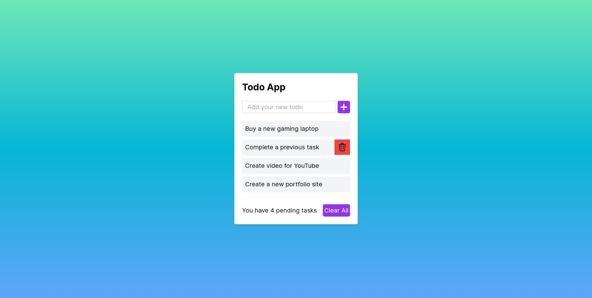

# TodoApp

## Table of contents

- [Overview](#overview)
  - [The challenge](#the-challenge)
  - [Screenshot](#screenshot)
  - [Link](#link)
- [My process](#my-process)
  - [Prerequirements](#prerequirements)
  - [Built with](#built-with)
  - [How to run the project](#how-to-run-the-project)
  - [Useful resources](#useful-resources)
- [Author](#author)
- [Acknowledgments](#acknowledgments)

## Overview

### The challenge

Users should be able to:

- View the optimal layout for the site depending on their device's screen size
- See hover states for all interactive elements on the page
- Be able to see create new tasks
- Be able to read saved tasks
- Be able to delete a single task
- Be able to delete all tasks

### Screenshot

  

    
  

### Link

- Live Demo: [https://guillermosancheztodoapp.netlify.app/](https://guillermosancheztodoapp.netlify.app/)

### My process

### Prerequirements

- Node v20.11.1
- npm v10.2.4

### Built with

- Mobile-first workflow
- Semantic HTML5 markup
- Tailwind CSS
- [React](https://reactjs.org/) - JS library
- [Next.js](https://nextjs.org/) - JS Framework
- [Typescript](https://www.typescriptlang.org/) - Strongly typed programming language that builds on JavaScript

## How to run the project

To run the project, follow these steps:

1. Clone the repository `git@github.com:Guille-Sanchez/todo-app.git`.
2. Once cloned, execute `npm install` to install dependencies.
3. Execute `npm run dev` to run the project.

After following these steps, the project should be up and running.

### Useful resources

- [React Hero Icons](https://heroicons.com/) - Recommended resource for icons.

## Author

- LinkedIn - [Guillermo Sanchez](https://www.linkedin.com/in/guillermo-sanchez-52a616268)
